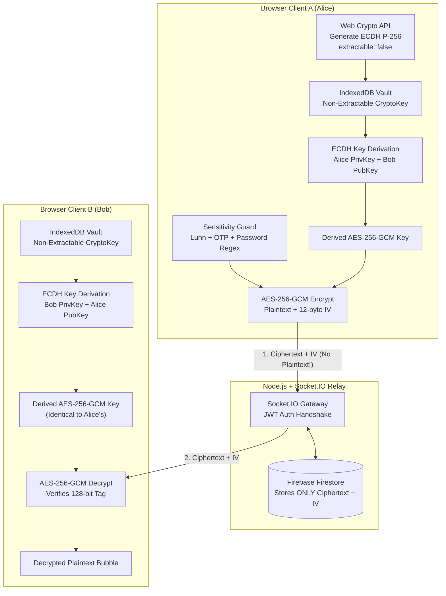

# 🛡️ SecureChat — Zero-Knowledge End-to-End Encrypted Messenger

[](https://www.typescriptlang.org/)
[](https://reactjs.org/)
[](https://nodejs.org/)
[](https://socket.io/)
[](https://tailwindcss.com/)
[](https://developer.mozilla.org/en-US/docs/Web/API/Web_Crypto_API)
[-00ff88?style=flat)](https://vitest.dev/)

> **A production-styled, zero-knowledge browser-encrypted real-time chat web application featuring ECDH P-256 key agreement, AES-256-GCM authenticated messaging, and a client-side AI-style sensitive data warning guard.**

---

## 🔗 Live Demo & Links
- **Live Frontend (Vercel):** `https://securechat-demo.vercel.app` *(Demo link placeholder)*
- **Live Backend (Render):** `https://securechat-api.onrender.com` *(Demo link placeholder)*
- **GitHub Repository:** `https://github.com/Narasimman-26/SecureChat`

---

## 📸 Screenshots & UI Preview
*(Place your screen recordings or screenshots here for recruiters)*
- **Landing Page & Live Crypto Playground**: Hero section with interactive real-time cryptographic cipher sandbox.
- **End-to-End Encrypted Chat Room**: Dark cyberpunk UI with neon cyan & emerald accents, typing indicator, online presence, delivered/read receipts.
- **Sensitive Content Guard Modal**: Proactive detection of cards, passwords, OTPs, and phone numbers before encryption.
- **Raw Ciphertext Inspection Mode**: Toggle to reveal base64 cipher blocks and 12-byte IVs inside chat bubbles.

---

## 🚀 Key Features

1. **Client-Side Key Generation (Hardware-Isolated)**:
   - Private keys are generated using the browser native **Web Crypto API** with `extractable: false`.
   - Stored in browser **IndexedDB** as non-extractable `CryptoKey` handles — inaccessible to scripts, extensions, or developer console export.
2. **ECDH P-256 Key Exchange**:
   - Alice and Bob only exchange public keys (P-256 JWK format).
   - Both independently compute identical 256-bit symmetric AES-GCM keys on their local machines without transmitting the shared key over the network.
3. **AES-256-GCM Authenticated Encryption**:
   - Each message receives a fresh, cryptographically secure 12-byte (96-bit) Initialization Vector (IV).
   - Built-in 128-bit authentication tag ensures instant tamper detection. Any payload alteration aborts decryption.
4. **Zero-Knowledge Relay Server & Firestore**:
   - The Node.js server and Firebase Firestore **only receive, relay, and store ciphertext**.
   - Plaintext never reaches the wire or database.
5. **AI-Style Sensitive Content Guard**:
   - Client-side heuristic and regex inspection detects:
     - Payment card numbers (validated via the **Luhn algorithm**)
     - Passwords and credential markers (`password:`, `secret=`, etc.)
     - One-Time Passwords (OTPs / 2FA codes)
     - International phone numbers
   - Prompts a confirmation modal: *"This looks sensitive. Send anyway?"* before encrypting.
6. **Demo Mode Toggle: "Show Raw Encrypted Data"**:
   - Setting toggle that displays the raw Base64 ciphertext, IV, and cipher parameters directly inside message bubbles.
   - Built specifically for demo videos and portfolio evaluations.
7. **Disappearing Messages (Configurable Ephemeral Timer)**:
   - Per-chat timer options: Off, 10s (fast demo), 30s, 5m, 1h, 24h.
   - Dissolves message bubbles on clients with countdown timers and auto-purges expired records from the database.
8. **Interactive Landing Page & Encryption Playground**:
   - Type plaintext live in the browser, inspect the real-time AES-256-GCM output and IV, and test 1-byte tamper resistance with instant authentication tag rejection.

---

## 🏛️ System Architecture



---

## 🔐 How The Encryption Works

### 1. Key Generation
```typescript
const keyPair = await window.crypto.subtle.generateKey(
  { name: 'ECDH', namedCurve: 'P-256' },
  false, // Non-extractable private key!
  ['deriveKey', 'deriveBits']
);
```
The private key is stored directly in IndexedDB. It cannot be extracted as raw bytes, even through browser developer tools or malicious scripts.

### 2. Diffie-Hellman Key Agreement (ECDH)
When Alice chats with Bob:
$$\text{SharedSecret} = \text{Alice}_{\text{private}} \times \text{Bob}_{\text{public}} = \text{Bob}_{\text{private}} \times \text{Alice}_{\text{public}}$$
Both compute the identical 256-bit symmetric key without transmitting it:
```typescript
const sharedAesKey = await window.crypto.subtle.deriveKey(
  { name: 'ECDH', public: peerPublicKey },
  myPrivateKey,
  { name: 'AES-GCM', length: 256 },
  false,
  ['encrypt', 'decrypt']
);
```

### 3. Authenticated Symmetric Encryption (AES-GCM)
```typescript
const iv = window.crypto.getRandomValues(new Uint8Array(12));
const ciphertext = await window.crypto.subtle.encrypt(
  { name: 'AES-GCM', iv },
  sharedAesKey,
  new TextEncoder().encode(plaintext)
);
```
AES-GCM calculates an authentication tag over the ciphertext. If an attacker or corrupted database alters even a single bit in transit, `crypto.subtle.decrypt` throws an authentication error and rejects the message.

---

## 📁 Project Structure

```
securechat/
├── shared/                 # Shared TypeScript interfaces & schemas
│   ├── types.ts            # User, Message, CiphertextPayload, Socket events
│   └── index.ts
│
├── server/                 # Node.js + Express + Socket.IO Backend
│   ├── src/
│   │   ├── config.ts       # Environment variable validation
│   │   ├── db/
│   │   │   └── firestore.ts# Firestore adapter (Ciphertext-only storage)
│   │   ├── middleware/
│   │   │   └── auth.ts     # JWT verification middleware
│   │   ├── routes/
│   │   │   ├── auth.routes.ts # Signup, Login, Me endpoints
│   │   │   ├── user.routes.ts # User search & public key exchange
│   │   │   └── chat.routes.ts # Conversations & message history
│   │   ├── socket/
│   │   │   └── index.ts    # Socket.IO real-time relay, receipts, presence
│   │   └── index.ts        # Server entrypoint & CORS config
│   ├── .env.example
│   └── package.json
│
├── web/                    # React + Vite + TypeScript Frontend
│   ├── src/
│   │   ├── crypto/         # Web Crypto API engine & IndexedDB vault
│   │   │   ├── index.ts
│   │   │   └── __tests__/
│   │   │       └── crypto.test.ts # Vitest roundtrip & tamper unit tests
│   │   ├── utils/
│   │   │   ├── sensitivity.ts    # Luhn credit card, OTP, password heuristics
│   │   │   └── __tests__/
│   │   │       └── sensitivity.test.ts
│   │   ├── context/
│   │   │   ├── AuthContext.tsx    # User session & keypair generator
│   │   │   └── SettingsContext.tsx# Demo raw ciphertext toggle
│   │   ├── components/
│   │   │   ├── ChatHeader.tsx     # Presence, E2EE lock badge, disappearing timer
│   │   │   ├── ChatSidebar.tsx    # Active chats list, unread counters
│   │   │   ├── MessageBubble.tsx  # Bubble with live countdown & raw ciphertext
│   │   │   ├── SensitivityModal.tsx # Proactive sensitive content warning
│   │   │   ├── EncryptionInfoModal.tsx # Cryptographic specs modal
│   │   │   ├── DisappearingTimerModal.tsx
│   │   │   └── NewChatModal.tsx   # Search & initiate chat
│   │   ├── pages/
│   │   │   ├── LandingPage.tsx    # Hero, 3 steps, feature cards, live playground
│   │   │   ├── AuthPage.tsx       # Cyberpunk login/signup with demo autofill
│   │   │   ├── ChatPage.tsx       # Real-time encrypted messenger
│   │   │   └── SettingsModal.tsx  # Key fingerprint & demo settings
│   │   ├── App.tsx
│   │   └── main.tsx
│   ├── index.html
│   ├── tailwind.config.js
│   ├── vercel.json
│   └── package.json
│
├── render.yaml             # Render deployment configuration
└── package.json            # Monorepo scripts
```

---

## 🛠️ Quickstart & Local Setup

### Prerequisites
- Node.js `v18+` (v20+ or v24+ recommended)
- npm `v9+`

### 1. Clone the repository
```bash
git clone https://github.com/Narasimman-26/SecureChat.git
cd SecureChat
```

### 2. Install dependencies
```bash
# Install root, server, and web packages
npm install
npm --prefix server install
npm --prefix web install
```

### 3. Configure environment variables
```bash
# Server configuration
cp server/.env.example server/.env

# Web configuration
cp web/.env.example web/.env
```

*(Note: The server includes an automatic zero-config in-memory Firestore simulator for immediate local testing. To connect to live Google Cloud Firestore, supply `FIREBASE_PROJECT_ID`, `FIREBASE_CLIENT_EMAIL`, and `FIREBASE_PRIVATE_KEY` in `server/.env`).*

### 4. Run the application
Open two terminals or use the root commands:

```bash
# Terminal 1: Start Backend Relay Server (Port 5000)
npm run dev:server

# Terminal 2: Start Web Client (Port 5173)
npm run dev:web
```

Visit **`http://localhost:5173`** in your browser!

### 5. Fast Two-Party Testing (Recruiter Quick-Start)
1. Open `http://localhost:5173` in a regular browser tab.
2. Click **Log In** -> Click **"Fill Alice"** -> Click **Unlock Session**.
3. Open an **Incognito Window** (or secondary browser) to `http://localhost:5173`.
4. Click **Log In** -> Click **"Fill Bob"** -> Click **Unlock Session**.
5. Click **New Chat** in either window, search for the other user, and start exchanging encrypted messages in real-time!
6. Open **Settings** and toggle **"Show raw encrypted data"** to see the AES-256-GCM cipher blocks update live!

---

## 🧪 Running Unit Tests

The test suite validates cryptographic roundtrips, key agreement symmetry, and Galois/Counter Mode tamper resistance using **Vitest**:

```bash
npm test
```

### Test Coverage Highlights:
- ✅ Non-extractable ECDH P-256 keypair generation
- ✅ ECDH key derivation symmetry between Alice and Bob
- ✅ AES-256-GCM message encryption/decryption roundtrip
- ✅ Tamper detection: altered ciphertext bytes trigger authentication tag rejection
- ✅ Initialization Vector (IV) integrity enforcement
- ✅ Client-side sensitive data detection: credit cards (Luhn algorithm), passwords, OTPs, phone numbers

---

## ☁️ Deployment

### Frontend (Vercel)
1. Import repository to Vercel with root directory set to `web`.
2. Framework preset: **Vite**.
3. Build command: `npm run build` (Output directory: `dist`).
4. Set environment variable: `VITE_API_URL=https://your-backend.onrender.com/api` and `VITE_SOCKET_URL=https://your-backend.onrender.com`.
5. Configuration is pre-wired in `web/vercel.json`.

### Backend (Render)
1. Create a New Web Service on Render linked to this repository.
2. Root Directory: `server`.
3. Build Command: `npm install && npm run build`.
4. Start Command: `node dist/index.js`.
5. Set Environment Variables:
   - `PORT`: `10000`
   - `CLIENT_URL`: `https://your-app.vercel.app`
   - `JWT_SECRET`: `your_random_secret_string`
6. Configuration is also defined in `render.yaml`.

---

## 📜 License
MIT License. Built for portfolio, resume demonstration, and educational purposes.
